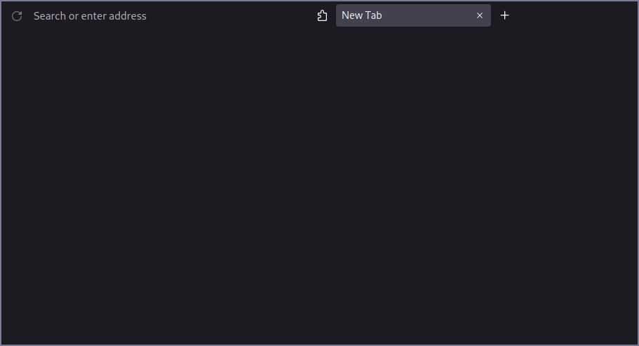

This is a simple Firefox theme that includes just the basic needed things for a better Firefox experience it also includes a user.js file using Betterfox

 

The original theme was made by Eric Murphy (his GitHub 👉 https://github.com/ericmurphyxyz) and the original theme is in his GitHub profile. The user.js file is a code from BetterFox which can be found on GitHub. Also if you want to learn more I encourage you to look at Eric Murphy's YouTube that's where I learned this. Even tho he isn't making coding content directly he is making tech-related content which I think everyone should check out. Eric Murphy's YouTube 👉 https://www.youtube.com/@EricMurphyxyz

also, a disclaimer I put BetterFox in here not because it is a part of the theme but because it is a good security resource to make your browser and browsing experience more private you can easily remove it yourself if you do not want it.

repos:
- BetterFox 👉 https://github.com/yokoffing/Betterfox
- FirefoxTheme 👉 https://github.com/ericmurphyxyz/userChrome.css

Screenshot of the theme:

